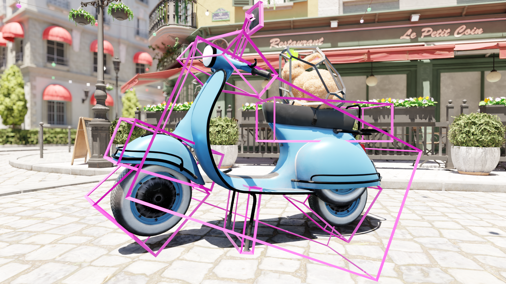

Building Oriented Bounding Boxes by the intermediate use of ODOPs
=================================================================

Source code supporting the paper Sabino et al. 2023 https://doi.org/10.1016/j.cag.2023.08.028




# About

This project implements a multithreaded BVH builder based on PLOCTree that
supports different bounding volumes including AABBs and OBBs.

It also implements a GPU ray tracer based on OpenGL compute that profiles the
BVH.


# Requirements

Scenes inside the directory ``res/`` have been compressed in .zip files. They
should be extracted before running the algorithm.

OpenGL 4.5+ with GLSL version 4.5+ driver is needed/recommended to run this
application. Compatibility tested on Nvidia GPUs.

Application intended to be run on Linux machines. Tested on Debian 11.


# Compiling

The ``Makefile`` refers to different build targets, each of which tests
different aspects involved in the deveoplment of the algorithm proposed in the
original paper.

Use ``make`` to build your project. Targets are: **all** (default),
**clean**, **run**. Use:

``make run``

To build and run the default testing configuration.


# Usage

Ray tracing might take a while, if you happen to get a black screen it probably
means that you lost connection to your graphics card. You can disable this
timeout by adding the following lines to your **xorg.conf** or similar config
file:

```
Section "Device"
    Identifier     "Device0"
    Driver         "nvidia"
    VendorName     "NVIDIA Corporation"
    Option         "Interactive" "0"
EndSection
```
